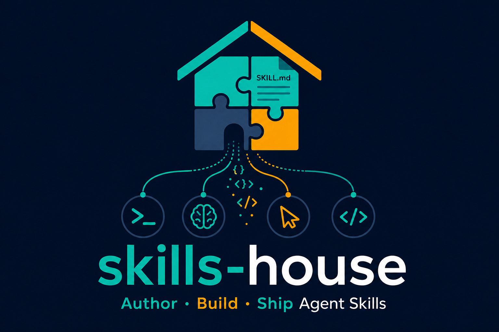
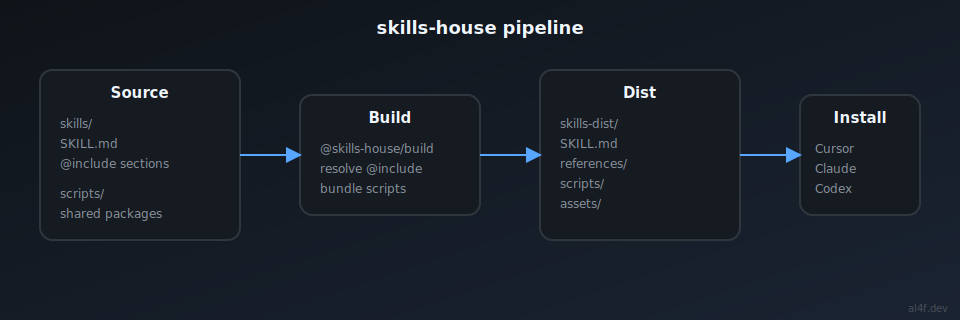

<p align="center">
  
</p>

# skills-house


**Author, build, and ship agentic software with [Agent Skills](https://agentskills.io) — from one framework.**

skills-house is an open-source **framework** for building skill-based agent apps — built by [al4f](https://al4f.dev). Scaffold a project, define skills, compile to spec-compliant output, and ship to Cursor, Claude, Codex, mobile agents, and more.

**Framework docs:** **[al4f.dev](https://al4f.dev)** · [Architecture specs](./specs/) · [Agent Skills at Scale](https://al4f.dev/writing/agent-skills-at-scale.html)

**Built by [al4f](https://github.com/al4f)** — Agent Skills infrastructure engineer.

**Install a skill in any repo** ([skills.sh CLI](https://www.skills.sh/docs/cli)):

```bash
npx skills add al4f/skills-house --skill skill-auditor -a cursor -y
```

---

## Why skills-house?

Agent Skills are powerful, but authoring them at scale gets messy fast:

- Duplicated scripts across skills
- Large `SKILL.md` files that burn context
- Manual copying into `~/.cursor/skills`, `.agents/skills`, `.claude/skills`, …
- No shared build step between source and what agents actually load

skills-house fixes that with a clear split — for developers and non-developers building agentic apps with Cursor, Claude, mobile agents, and more:

| Layer | What it is |
|-------|------------|
| **Source** (`skills/`) | Freeform authoring — only `SKILL.md` is required |
| **Scripts** (`scripts/`) | Reusable execution packages shared across skills |
| **Build** (`@skills-house/build`) | Compiles markers + links → Agent Skills layout |
| **Dist** (`skills-dist/`) | What agents consume |
| **Install** | One command per agent or all at once |

---

## Features

- **Simple authoring** — `@include` for markdown fragments; standard `[label](target)` links for everything else
- **Shared script packages** — reference `fixture-helper/hello` instead of copy-pasting shell scripts
- **Agent Skills compliant output** — `SKILL.md`, `references/`, `scripts/`, `assets/`
- **Multi-agent install** — global (`~/.cursor/skills`, `~/.agents/skills`, …) or project-local (`.agents/skills`, `.claude/skills`, …)
- **pnpm monorepo** — skills, scripts, and tooling in one workspace

---

## Quick start

```bash
npx create-skills-house my-app
cd my-app
pnpm dev          # build + install skills to this project
```

**Contributors** — work from this reference monorepo:

**Requirements:** Node.js LTS (see `.nvmrc`), [pnpm](https://pnpm.io)

```bash
git clone https://github.com/al4f/skills-house.git
cd skills-house
nvm use
pnpm install
pnpm build
```

Install built skills into your agent (optional):

```bash
pnpm install:skills --scope project
```

Install globally for all agents:

```bash
pnpm install:skills
```

Uninstall:

```bash
pnpm remove:skills --scope project
pnpm remove:skills --scope project
pnpm remove:skills --agent cursor --skill skill-auditor
```

---

## Example skill

One reference skill ships with the framework to demonstrate patterns — not a catalog:

| Skill | Description |
|-------|-------------|
| [skill-auditor](./skills/skill-auditor/) | Validates Agent Skills before ship — shows `@include`, references, and shared scripts |

Add your own skills under `skills/<name>/`. Skill PRs auto-merge when validation passes. See [Contributing](#contributing).

---

## Authoring a skill

Source layout is **freeform**. The build only requires `SKILL.md` as entry.

```markdown
---
name: my-skill
description: What it does and when to use it.
---

# My Skill

@include /sections/workflow.md

Read [the guide](/references/deep-dive.md) when needed.
Run [hello](fixture-helper/hello).
```

### Reference rules

| Link target | Meaning |
|-------------|---------|
| `/references/foo.md` | In-package file → copied to dist |
| `package/export` | Named export from a `scripts/` package |
| `other-skill` | Skill dependency (install note injected at build) |

Only **`@include /path`** is a build marker. Everything else uses markdown links.

Full spec: **[specs/authoring/skill-md-authoring.md](./specs/authoring/skill-md-authoring.md)**

---

## Project structure

```
skills-house/
├── skills/                  # Source skill packages (author here)
├── scripts/                 # Shared script packages (package.json exports)
├── internal-scripts/
│   ├── build/               # @skills-house/build — skill compiler
│   ├── create/              # create-skills-house scaffolder
│   ├── cli/                 # optional dev CLI (pnpm skills)
│   └── install/             # install-skills.sh, remove-skills.sh
├── skills-dist/             # Built Agent Skills output
└── specs/                   # Architecture & design docs
```

---

## Commands

| Command | Description |
|---------|-------------|
| `pnpm build` | Build compiler + all skills |
| `pnpm test` | Run build pipeline tests |
| `pnpm validate` | Run per-package validate scripts + registry typecheck |
| `pnpm generate` | Generate registry index, search index, dependency graph, website data |
| `pnpm generate:check` | Regenerate and fail if output is stale |
| `pnpm install:skills` | Install built dist skills to agent directories (monorepo dev) |
| `npx skills add al4f/skills-house --skill <name>` | Install from GitHub via [skills.sh](https://www.skills.sh/docs/cli) ([guide](./content/publish/INSTALL.md)) |
| `npx create-skills-house <dir>` | Scaffold a new skills-house project |
| `pnpm remove:skills` | Remove installed skills (monorepo script) |

Build a single skill:

```bash
pnpm --filter @skills-house/skill-auditor build
```

### Install flags

| Flag | Description |
|------|-------------|
| `--agent cursor\|claude\|codex\|agents` | Target one agent |
| `--scope global\|project` | User home vs repo-local paths |
| `--skill <name>` | Install/remove one skill only |
| `--copy` | Copy files instead of symlinking (install only) |
| `--dry-run` | Preview actions |

### Install paths

**Global** (`pnpm install:skills`):

| Agent | Directory |
|-------|-----------|
| agents (open standard) | `~/.agents/skills/` |
| codex | `~/.codex/skills/` |
| cursor | `~/.cursor/skills/` |
| claude | `~/.claude/skills/` |

**Project** (`pnpm install:skills --scope project`):

| Agent | Directory |
|-------|-----------|
| agents / codex | `.agents/skills/` |
| cursor | `.agents/skills/` + `.cursor/skills/` |
| claude | `.claude/skills/` |

Project install paths are gitignored — they are local symlinks/copies from `skills-dist/`.

---

## Architecture



```
skills/ + scripts/          skills-dist/           agent dirs
┌─────────────────┐        ┌──────────────┐       ┌──────────────────┐
│ SKILL.md        │        │ SKILL.md     │       │ ~/.cursor/skills │
│ @include        │ build    │ references/  │ install │ ~/.claude/skills │
│ [links](…)      │ ──────►  │ scripts/     │ ────► │ ~/.agents/skills │
└─────────────────┘        └──────────────┘       └──────────────────┘
```

Deep dive: **[specs/architecture/monorepo-overview.md](./specs/architecture/monorepo-overview.md)**

---

## Contributing

skills-house has two contribution types:

1. **Skill contributions** — content under `skills/<name>/` auto-merges when schema, lint, docs, and dependency checks pass
2. **Framework contributions** — build system, CLI, generators, website, CI require maintainer review

See [CONTRIBUTING.md](./CONTRIBUTING.md) for the full workflow.

---

## Demo

Screen recording script: [content/demo-video/SCRIPT.md](./content/demo-video/SCRIPT.md) — *Author to Install in 5 Minutes*

## Roadmap

- [ ] Publish `create-skills-house` to npm
- [x] `create-skills-house` scaffolder (one-command project setup)
- [x] Nested `@include` support
- [x] skills.sh consumer install (`npx skills add al4f/skills-house`)
- [x] npm dist publish workflow + `@skills-house/skill-skill-auditor`
- [x] CI, al4f.dev, custom domain
- [x] Registry generator (metadata, search, dependency graph — internal tooling)
- [x] Framework docs site on al4f.dev
- [x] Auto-merge for skill contributions

Optional: [PROGRESS.md](./content/publish/PROGRESS.md) — brand content, demo, ecosystem.

---

## License

[MIT](./LICENSE) © [al4f](https://github.com/al4f)

---

## Links

- [al4f.dev](https://al4f.dev) — articles and architecture notes by the author
- [Agent Skills specification](https://agentskills.io)
- [Architecture specs](./specs/)
- [SKILL.md authoring spec](./specs/authoring/skill-md-authoring.md)
- [Contributing](./CONTRIBUTING.md)
